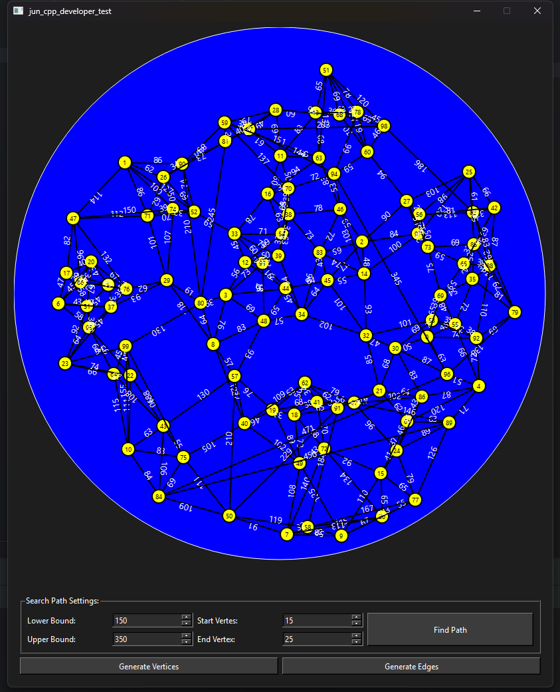
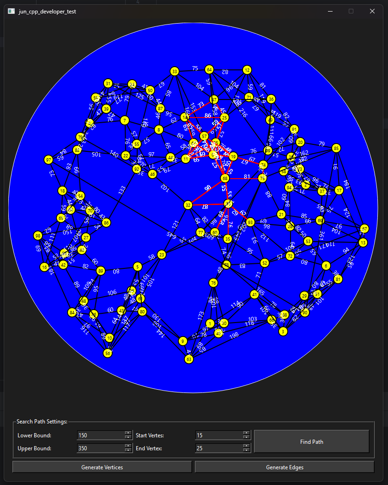

# Тестовое задание на позицию junior C++ developer
___

## Задача
___

> Случайным образом задаются сто точек точки внутри окружности. Соединить их таким образом, чтобы каждая 
> точка была соединена как минимум с двумя соседними, как максимум - с шестью.
> 
> Необходимо найти маршрут который бы имел протяжённость между установленными нижним и верхним значениями.

## Решение
___

### Структура и принцип работы программы:
___

> Программа разделена на модули:
> - `Graph` который отвечает за построение структуры графа, и хранение его состояния.
> - `ControlWidget` это класс в котором объеденины все элементы управления приложением.
> - `GraphWindow` отвечает за отрисовку графа. 
> - `MainWindow` это класс который объединяет все компоненты в одно приложение, а так же управляет
> всеми сигналами и контроллерами.

### Алгоритм:
___

> Основная логика программы реализована при помощи трёх основных алгоритмов: 
> - Генерация узлов в случайных координатах.
> - Генерация связей между узлами.
> - Поиск пути между двумя узлами в пределах минимального и максимального расстояния пути.

> __Алгоритм генерации узлов:__ состоит из главного метода `generateVertexList()` а так же вспомогательных методов:
> - `generatePoint()` генерирует случайные координаты. 
> - `isPointInsideCircle()`  проверяет находятся ли координаты внутри круга.
> - `isOverlappingWithExistingCircles()` проверяет пересекаются ли координаты с существующими узлами.

> __Алгоритм генерации связей:__ состоит из главного метода `generateEdgeSet()` а так же вспомогательных методов:
> - `addEdge()` добавляет в вектор со связями новое ребро.
> - `linkVertexNeighbors()` объединяет два узла между собой.
> - `calcDistance()` рассчитывает расстояние между двумя точками

> __Алгоритм поиска пути:__ состоит из главного метода `findPath()` а так же вспомогательных методов:
> - `findPath()` это модифицированный алгоритм поиска в ширину (BFS), который находит все пути между 
> двумя вершинами в графе, ограничивая их по весу с заданными нижней и верхней границами.
> - `convertPathToEdge()` преобразует полученную структуру из `std::vector<Path>` в `std::vector<std::vector<Edge>>`.
> - `setDiscoveredPathVectors()` сеттер который устанавливает новые значения для вектора найденных путей.
> - `buildPath()` это метод обёртка который объединяет в себе все необходимые методы для построения пути и дальнейшей
> отрисовки.

## Графический интерфейс:

___

>> Приложение имеет графический интерфейс для генерации и отрисовки графа, а именно:
>> - `Generate Vercies` генерирует новые вершины
>> - `Generate Edges` генерирует связи между вершинами
>> - `Lower Bound` устанавливает нижнюю границу протяжённости пути
>> - `Upper Bound` устанавливает верхнюю границу протяжённости пути
>> - `Start Vertex` устанавливает начальную точку поиска пути
>> - `End Vertex` устанавливает конечную точку поиска пути
> 
> 

>> После генерации структуры графа, он отрисовывает все узлы и связи, а так же дистанцию между узлами
>
> 

>> При генерации пути от стартовой точки до конечной, находятся все возможные пути имеющие протяжённость
>> между нижним и верхним пределом.
>
> 

